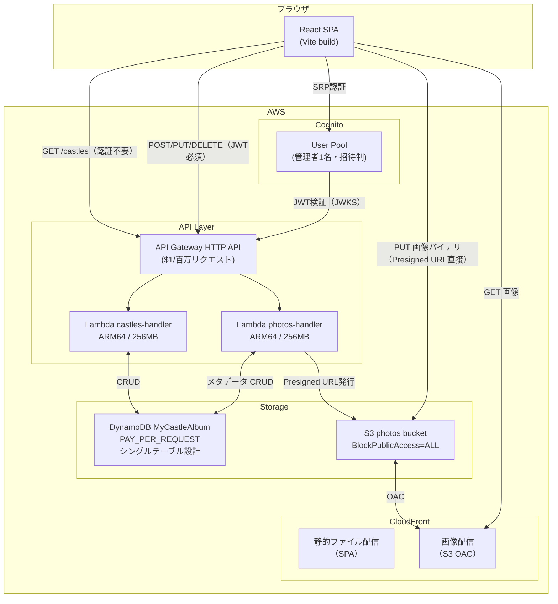

# AWS アーキテクチャ設計 — My Castle Album

## アーキテクチャ図



---

## Phase 8: AWS基盤 (CDK・DynamoDB・S3・CloudFront)

### 8-0: CDK デプロイ前提条件

Phase 8 着手前に以下を準備する。

**1. AWS アカウント・CLI 設定**
```bash
aws configure  # または aws sso login
aws sts get-caller-identity  # 疎通確認
```

**2. CDK Bootstrap（初回のみ）**
```bash
npx cdk bootstrap aws://{ACCOUNT_ID}/ap-northeast-1
```

**3. デプロイ方針（どちらか選択）**

| 方式 | 用途 | Credential 管理 |
|------|------|----------------|
| ローカル手動デプロイ | 個人開発（当面はこちら） | `~/.aws/credentials`（IAM User または SSO） |
| CI/CD（GitHub Actions） | 将来自動化する場合 | OIDC による一時クレデンシャル（アクセスキー不要） |

当面はローカル手動デプロイで進める。CI/CD 化する際は GitHub Actions の `aws-actions/configure-aws-credentials` + OIDC を採用する（長期アクセスキーをシークレットに保存しない）。

---

### 8-1: packages/infra パッケージ構成

```
packages/infra/
  bin/
    app.ts            ← CDK App エントリーポイント
  lib/
    storage-stack.ts  ← DynamoDB + S3
    api-stack.ts      ← Lambda + API Gateway
    auth-stack.ts     ← Cognito
  lambda/
    castles/
      handler.ts
    photos/
      handler.ts
  package.json
  tsconfig.json
  cdk.json
```

依存: `aws-cdk-lib`, `constructs`, `esbuild`（Lambda bundling用）

### 8-2: DynamoDB テーブル設計

**テーブル名: `MyCastleAlbum`（シングルテーブル設計）**

| 属性 | 型 | 説明 |
|------|-----|------|
| `PK` | String (Partition Key) | `CASTLE#{castleId}` |
| `SK` | String (Sort Key) | `METADATA` または `PHOTO#{photoId}` |
| `name` | String | 城名（Castle行のみ） |
| `latitude` | Number | 緯度（Castle行のみ） |
| `longitude` | Number | 経度（Castle行のみ） |
| `caption` | String | 写真説明（Photo行のみ、任意） |
| `GSI1PK` | String | `ALL_CASTLES`（findAll用） |
| `GSI1SK` | String | `CASTLE#{castleId}` |

**アクセスパターン:**

| アクセスパターン | 操作 |
|----------------|------|
| 全城一覧取得 | GSI1: `GSI1PK = ALL_CASTLES` |
| 城1件取得（写真込み） | Query: `PK = CASTLE#{id}` |
| 城保存（新規/更新） | PutItem: `PK=CASTLE#{id}, SK=METADATA` |
| 城削除（写真も一括） | Query で写真一覧取得 → BatchWriteItem で25件ずつ分割削除（TransactWrite は25オペ上限のため不使用）。補償処理: 分割途中でエラーが出た場合は再実行で冪等になるよう DeleteItem を繰り返す。孤立 PHOTO レコードは Castle METADATA が存在しないものとして定期クリーンアップで対処可 |
| 写真追加 | PutItem: `PK=CASTLE#{id}, SK=PHOTO#{photoId}` |
| 写真削除 | DeleteItem: `PK=CASTLE#{id}, SK=PHOTO#{photoId}` |

CDK: `billing: dynamodb.Billing.onDemand()`（PAY_PER_REQUEST）

### 8-3: S3 バケット設計

**バケット名: `my-castle-album-photos-{accountId}-{region}`**
- `BlockPublicAccess` 全項目 BLOCK
- S3マネージド暗号化
- CORS: PUT/GET を本番ドメインからのみ許可（ワイルドカード禁止）

**オブジェクトキー命名規則:**
```
photos/{castleId}/{photoId}.jpg
```

### 8-4: CloudFront ディストリビューション

- OAC（Origin Access Control）でS3に接続（OAIは非推奨のため不使用）
- `REDIRECT_TO_HTTPS` 強制
- `PRICE_CLASS_200`（アジア・北米・欧州含む）
- S3バケットポリシーは CloudFront の SourceArn で絞る

---

## Phase 9: バックエンドAPI (Lambda・API Gateway)

### API エンドポイント一覧

| メソッド | パス | 認証 | 説明 |
|---------|------|------|------|
| GET | `/castles` | 不要 | 全城一覧取得（photos含む） |
| GET | `/castles/{castleId}` | 不要 | 城1件取得（photos含む） |
| POST | `/castles` | JWT必須 | 城追加 |
| PUT | `/castles/{castleId}` | JWT必須 | 城更新 |
| DELETE | `/castles/{castleId}` | JWT必須 | 城削除（写真も連動削除） |
| POST | `/castles/{castleId}/photos` | JWT必須 | 写真メタデータ登録 + Presigned URL発行 |
| DELETE | `/castles/{castleId}/photos/{photoId}` | JWT必須 | 写真削除（S3 + DynamoDB） |

### Lambda 構成
- `castles-handler`: Castle CRUD
- `photos-handler`: Photo管理 + Presigned URL発行
- Runtime: Node.js 22.x / ARM64 (Graviton2・20%コスト削減) / 256MB / タイムアウト10秒

### 画像アップロードフロー（Presigned URL）

```
フロントエンド                Lambda                S3
    |                          |                     |
    |-- POST /photos --------->|                     |
    |   { contentType }        |                     |
    |                          |-- getSignedUrl ----->|
    |                          |<- presignedUrl ------|
    |<- { photoId, presignedUrl, imageUrl } ----------|
    |                          |                     |
    |-- PUT presignedUrl (画像バイナリ) ------------>|
    |<- 200 OK ----------------------------------------|
```

1. Lambda が `photoId`（ULID）を生成
2. DynamoDB に Photo メタデータを保存
3. S3 Presigned PUT URL を生成（有効期限5分）
4. フロントエンドが Presigned URL へ直接 PUT（Lambda・API Gateway を経由しない）

### IAM最小権限ロール

| ロール | 許可アクション | リソース |
|--------|---------------|---------|
| castles-handler | `dynamodb:GetItem`, `PutItem`, `DeleteItem`, `Query` | MyCastleAlbum テーブルのみ |
| photos-handler | 上記 + `s3:PutObject`, `s3:DeleteObject` | `photos/*` プレフィックスのみ |
| CloudFront OAC | `s3:GetObject` | バケット全体（読み取りのみ） |

各 Lambda に追加付与するのは `AWSLambdaBasicExecutionRole`（CloudWatch Logs）のみ。VPCアクセスは不要。

---

## Phase 10: 認証 (Cognito)

### Cognito User Pool 構成

| 設定項目 | 値 | 理由 |
|---------|-----|------|
| `selfSignUpEnabled` | false | 招待制・サイト所有者1名のみ |
| 認証フロー | SRP (`userSrpAuth`) | 平文パスワードを送信しない |
| `userPasswordAuth` | false | 平文認証を明示的に無効化 |
| MFA | TOTP Required | 管理者1名のみのため全員強制。**移行手順: ① 管理者アカウント作成 → ② TOTP アプリで設定完了 → ③ CDK で Required に変更してデプロイ。手順②③を逆にするとサインインが即ブロックされる。ロールバック: ブロックされた場合は AWS Console から Cognito User Pool の MFA 設定を Optional に一時戻し、TOTP 設定後に再度 Required にする** |
| パスワード | 12文字以上・大小英数記号必須 | |
| `generateSecret` | false | SPAはクライアントシークレット不要 |
| accessToken 有効期限 | 1時間 | |
| refreshToken 有効期限 | 30日 | |

### 認証フロー

1. ユーザーがメール・パスワードを入力
2. `amazon-cognito-identity-js` が Cognito へ SRP 認証
3. idToken・accessToken（**メモリ保持**）+ refreshToken（**sessionStorage**）を取得
4. 管理系APIリクエスト時に `Authorization: Bearer {accessToken}` を付与
5. API Gateway JWT Authorizer が Cognito JWKS で自動検証（Lambda内では検証不要）

- **accessToken を Bearer に使う**（idToken は身元証明用。API Gateway に渡すと email 等の PII がログに記録される）
- **refreshToken は sessionStorage 保持**（localStorage はタブ跨ぎで永続するためセッション奪取リスクが高い。sessionStorage はタブ閉鎖で自動クリア）

**JWT Authorizer CDK 設定（`api-stack.ts`）:**
```typescript
const authorizer = new apigwv2authorizers.HttpJwtAuthorizer(
  'CognitoAuthorizer',
  `https://cognito-idp.${cdk.Aws.REGION}.amazonaws.com/${userPool.userPoolId}`,
  {
    jwtAudience: [userPoolClient.userPoolClientId],
    // accessToken を使うため tokenUse を明示（省略すると id/access 両方許可になる）
    identitySource: ['$request.header.Authorization'],
  }
);
// Cognito 側では accessToken の aud クレームが client_id と一致するかを自動検証する
```

> **必須実装**: API Gateway HTTP API の JWT Authorizer は `token_use` クレームを強制できない。Lambda ハンドラーの先頭で以下を **必須チェック** とし、不一致時は即 401 を返すこと（Phase 9 タスク 9-5）。
> ```typescript
> const claims = event.requestContext.authorizer?.jwt?.claims;
> if (claims?.token_use !== 'access') {
>   return { statusCode: 401, body: 'Unauthorized' };
> }
> ```

### 管理モード変更点

- 現在: 「管理モードへ」ボタンで即切り替え（認証なし）
- 変更後: 未認証時に `LoginModal` を表示 → ログイン成功で管理モードへ自動遷移
- ログアウトボタンを管理モード中に表示

---

## Phase 11: フロントエンドAWS統合

### 追加ファイル

| ファイル | 説明 |
|---------|------|
| `src/infrastructure/aws/AwsCastleRepository.ts` | `CastleRepository` のAWS実装（fetch + JWT付与） |
| `src/infrastructure/aws/AwsImageStorage.ts` | `ImageStorage` のAWS実装（Presigned URL使用） |
| `src/infrastructure/aws/cognitoAuth.ts` | Cognito 認証ラッパー（signIn・signOut） |
| `src/presentation/components/LoginModal.tsx` | ログインフォームモーダル |
| `src/presentation/hooks/useAuth.ts` | 認証状態管理カスタムフック |

### 変更ファイル

| ファイル | 変更内容 |
|---------|---------|
| `src/App.tsx` | `useAuth` 統合・管理モードを認証に依存・repository切り替え |
| `src/presentation/components/PhotoGallery.tsx` | `imageStorage` を props 注入に変更（直接 `new` をやめる） |

### 環境変数切り替え

```
# packages/frontend/.env.local（開発・gitignore対象）
VITE_USE_AWS=false

# packages/frontend/.env.production（gitignore対象・値はCI環境変数から注入）
VITE_USE_AWS=true
VITE_API_BASE_URL=https://xxxx.execute-api.ap-northeast-1.amazonaws.com
VITE_COGNITO_USER_POOL_ID=ap-northeast-1_XXXXXXXXX
VITE_COGNITO_CLIENT_ID=XXXXXXXXXXXXXXXXXXXXXXXXXX
VITE_CLOUDFRONT_DOMAIN=https://dXXXXXXXXXXXX.cloudfront.net
```

**.gitignore に追記すること（Phase 11 開始前に必ず対応）:**
```
packages/frontend/.env.local
packages/frontend/.env.production
```

値のプレースホルダーを保持するため `.env.production.example` をリポジトリに含め、実際の値は CI/CD の環境変数（GitHub Actions Secrets 等）から `${{ secrets.XXX }}` で注入する。

`App.tsx` での切り替え:
```typescript
const repository = import.meta.env.VITE_USE_AWS === 'true'
  ? new AwsCastleRepository(apiBaseUrl, getIdToken)
  : new LocalStorageCastleRepository();
```

---

## コスト見積もり

個人サイト（月間数十〜数百PV想定）

| サービス | 月額コスト | 備考 |
|---------|-----------|------|
| DynamoDB | **$0** | PAY_PER_REQUEST・無料枠内（25GB / 200万req） |
| Lambda | **$0** | 無料枠内（100万req / 400,000 GB秒） |
| API Gateway HTTP API | **$0** | 無料枠内（100万req、12ヶ月） |
| S3 | **~$0.001** | 写真50枚（50MB）想定 |
| CloudFront | **$0** | 無料枠内（1TB転送、12ヶ月） |
| Cognito | **$0** | 50,000 MAU無料・管理者1名 |
| **合計** | **$0〜$0.003/月** | |

初年度後（無料枠終了）でも ~$0.10〜$0.20/月。目標の月$1未満を大幅に下回る。

### コスト最適化の選択理由

| 選択 | 代替案 | 理由 |
|------|--------|------|
| API Gateway **HTTP API** | REST API | $1/百万 vs $3.5/百万（71%安） |
| Lambda **ARM64** | x86_64 | 同性能で20%安価 |
| DynamoDB **PAY_PER_REQUEST** | PROVISIONED | 低トラフィックは最低料金なしのオンデマンドが安価 |
| **Cognito** | Auth0 / Firebase Auth | 50,000 MAUまで無料 |
| **amazon-cognito-identity-js** | AWS Amplify | Amplify は 200KB+ と重い・このユースケースでは過剰 |

---

## セキュリティ設計

| 項目 | 対策 |
|------|------|
| **S3直接公開を防ぐ** | BlockPublicAccess全項目ON + CloudFront OACのみGET許可 |
| **API認可** | 読み取り系は認証不要（パブリックギャラリー）、書き込み系はCognito JWT Authorizer必須 |
| **CORS** | `allowOrigins` は本番ドメインのみ（ワイルドカード禁止） |
| **IAM最小権限** | Lambda各関数に必要なアクション・リソースのみ付与 |
| **HTTPS強制** | CloudFront `REDIRECT_TO_HTTPS` |
| **Cognito設定** | セルフサインアップ無効・SRP認証・TOTP MFA Required・強力なパスワードポリシー |
| **Presigned URL有効期限** | 5分（300秒） |
| **画像タイプ検証** | Lambda で `ContentType: image/*` のみ許可（クライアント申告値の検証）。マジックバイト検証は個人サイトの脅威モデルでは許容範囲として未実装 |
| **オブジェクトキー** | ULID使用（連番・予測可能なキーを避ける） |
| **DynamoDBインジェクション** | AWS SDK のパラメータバインディングを使用（文字列結合なし） |
